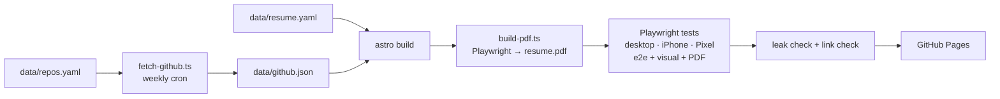

# mickosis.github.io

[](https://github.com/Mickosis/mickosis.github.io/actions/workflows/deploy.yml)

The resume and profile site of Miguel Carlo Rigunay, QA Chapter Lead. **Live:** https://mickosis.github.io · **PDF:** https://mickosis.github.io/resume.pdf

This repo maintains itself. Coding agents edit one YAML file. A CI pipeline refreshes GitHub stats every week, builds the site and a print-ready PDF, and tests both on desktop and mobile browsers. It blocks the deploy if anything regresses or if a private repository name would leak.

<!-- generated:start -->
**Miguel Carlo Rigunay**, QA Chapter Lead · Test Automation & AI

| | |
|---|---|
| Commits of mine across 16 repos | **1,321** |
| Commits in the last 90 days | **1,301** |
| Repos built with coding agents | **4** |

| Project | Stack | My commits | Last 90 days | Agent-built |
|---|---|---:|---:|:---:|
| [Pokémon Modern Emerald](https://github.com/Mickosis/Modern_Emerald) | C, Assembly | 92 | 93 | yes |
| [lrn2play](https://github.com/Mickosis/lrn2play) | AutoIt | 18 | 0 |  |
| [Shopify Shopper](https://github.com/Mickosis/shopifyshopper) | Python | 16 | 0 |  |
| [Playwright framework (JavaScript)](https://github.com/Mickosis/JSPlaywrightFramework) | JavaScript | 1 | 0 |  |
| [Selenium framework (Python)](https://github.com/Mickosis/PythonSelFramework) | Python, CSS | 3 | 0 |  |
| Online game server platform *(private)* | C, Python | 1,062 | 1,172 | yes |
| Privacy-first follower audit *(private)* | HTML, JavaScript | 9 | 2 |  |
| Game client anti-cheat *(private)* | C | 8 | 8 | yes |
| AI-assisted drum MIDI plugin *(private)* | C++ | 24 | 24 | yes |

<sub>Updated 2026-09-26 by the weekly workflow.</sub>
<!-- generated:end -->

## How it works



| Piece | What it does |
|---|---|
| `data/resume.yaml` | Single source of truth in the [JSON Resume](https://jsonresume.org/schema) schema, validated with zod |
| `scripts/fetch-github.ts` | Commit counts (mine vs. total), 90-day activity, merged PRs, releases, languages, weekly sparkline, agent-contract detection |
| Masked private repos | Shown by public alias only. The alias → repo mapping lives in a secret, and `leak-check.ts` fails the build if a private name reaches the output |
| `src/pages/print.astro` | Print layout rendered to an A4 PDF by headless Chromium, asserted at 2 pages or fewer |
| `tests/` | Playwright e2e and visual regression on Desktop Chrome, iPhone 13 (WebKit) and Pixel 7, in both themes |
| Theme | Ghostty's Dark+ palette with the Hack font, plus VS Code Light+ for light mode |

## Agent kit

Agent-first by design. [`AGENTS.md`](AGENTS.md) is the operating contract, and [`CLAUDE.md`](CLAUDE.md) adds Claude Code specifics. Slash commands:

- [`/update-resume`](.claude/commands/update-resume.md): paste notes or LinkedIn text, get a verified PR
- [`/refresh-projects`](.claude/commands/refresh-projects.md): rewrite project blurbs from current READMEs and commits
- [`/tailor`](.claude/commands/tailor.md): paste a job description, get a tailored PDF locally

## Local development

```bash
npm ci
npx playwright install chromium webkit
npm run dev                      # http://localhost:4321
npm run build && npm test        # full build + PDF + test suite
GITHUB_TOKEN=$(gh auth token) npm run fetch:github
```

## Secrets (repository settings → Secrets and variables → Actions)

| Secret | Purpose |
|---|---|
| `PRIVATE_STATS_TOKEN` | Fine-grained PAT, read-only **Metadata** + **Contents** on the private repos only |
| `PRIVATE_REPOS` | `alias=RepoA+RepoB;alias2=RepoC`, mapping masked aliases in `data/repos.yaml` to private repos |

Without them, the site still builds. Masked cards keep their last published numbers.
